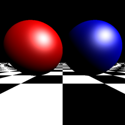
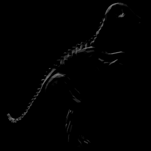

# RayTracer

Ray Tracing demos in Windows Form.

## Requirements

* Microsoft .NET Framework 4.0
* Microsoft Visual Studio 2010

## UI

## Demos

### TestDepth

Render time: about 0.06s.

### TestMaterial

Render time: about 0.09s.

### TestRayTracing

Render time: about 0.15s.

### TestDirectionalLight

Render time: about 0.13s.

### TestPointLight

Render time: about 0.13s.

### TestSpotLight

Render time: about 0.13s.

### TestTrichromatismLights

Render time: about 0.29s.

### TestManyLights

Render time: about 1.80s.

### TestObjModel

* Triangles

Render time: about 18s.

* Octree

Render time: about 3.8s.

